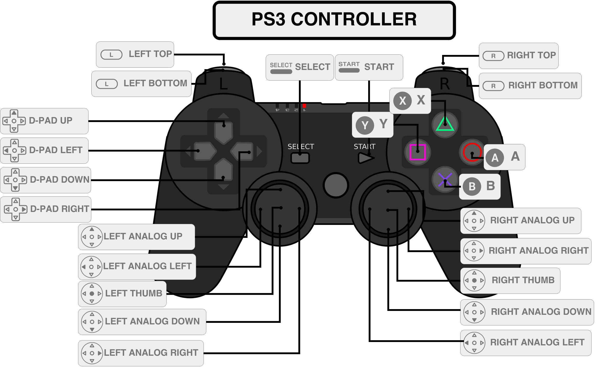
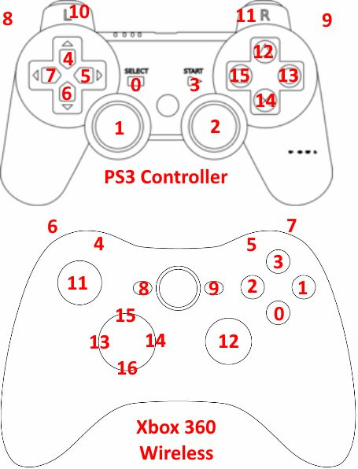

# Java package to manage Joystick for Ros OS independant
Based on these convention defined below.
It try to be compatible with the http://wiki.ros.org/joy
this use the package com.studiohartman.jamepad, so it works under windows32/64 linux64/Arm, Macos64

## interface IJoyMsgUpdater
This is a adaptor Interface to each model of joy.
to support a new Joy model please implements this interface.
The implementation provides a set of define BUTTON_## and AXIS_### allowing to play with the ros sensor_msgs.Joy tables
It can update a Joy msp with : updateJoyMsg

## JoyPublisher
This manage the publish of ros message.
you have to define the joy class : setJoy(), the joystick port number setPortNumber(), and the refresh rate setRefreshRateMs().

## JoyPS4
This is the adaptor for PS4 Joypad, this is tested.

## JoyPS3
This is the adaptor for PS3 Joypad.
(not tested)

## JoyXbox
This is the adaptor for Xbox Joypad.
(not tested today, but it will be done)

## JoyLogitech
This is the adaptor for Logitech Joypad, but it isn't implemented today you can do it !

